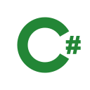

<h1 align="center">Hey, I'm Jon</h1>
<h3 align="center">Application Developer Apprentice from Switzerland 🇨🇭</h3>

  

---

### About

I'm doing my apprenticeship in application development at [Roche Diagnostics International AG](https://www.roche.ch/) in Rotkreuz, alongside my Berufsmaturität (BM).

At work I'm currently part of a team building AI agents and pipelines with LangGraph and PydanticAI, mostly Python backend stuff with a React frontend on top.

Outside of work I run a self-hosted homelab and build side projects. Breaking things turns out to be about as fun as building them.

When I'm not coding I'm at the gym, on my race bike, out running, watching anime or skiing in winter.

---

### Tech I Work With

I'm early in my career and don't claim to master any of these. I use all of them regularly, some better than others.

<table>
<tr>
<td align="center" width="88"> Python</td>
<td align="center" width="88"> TypeScript</td>
<td align="center" width="88"> C#</td>
<td align="center" width="88"> React</td>
<td align="center" width="88"> FastAPI</td>
<td align="center" width="88"> .NET</td>
<td align="center" width="88"> Blazor</td>
</tr>
<tr>
<td align="center" width="88"> Docker</td>
<td align="center" width="88"> Linux</td>
<td align="center" width="88"> nginx</td>
<td align="center" width="88"> Cloudflare</td>
<td align="center" width="88"> MySQL</td>
<td align="center" width="88"> GitLab</td>
</tr>
</table>

---

### What I'm Up To

- Running Docker on a Synology NAS, exposed through Cloudflare Tunnels
- Slowly poking at cybersecurity and red teaming
- Trying to learn Rust on the side

---

### GitHub Stats

> I use a separate work account, so these aren't the prettiest :)

  

  

  

---

### Reach Me

- **Portfolio**: [jon-zimmermann.com](https://jon-zimmermann.com)
- **Email**: me@jon-zimmermann.com
- **LinkedIn**: [jon-zimmermann](https://www.linkedin.com/in/jon-zimmermann)
